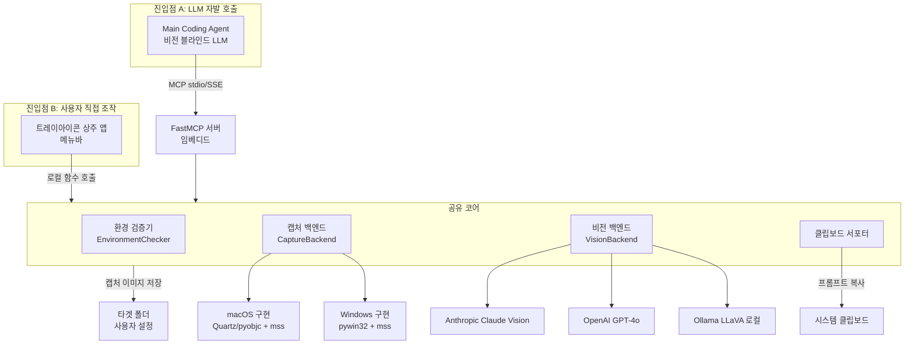

# Vision-Graft MCP (VGMCP) 기획서

> 본 기획서는 `docs/idea.md` 초안을 바탕으로, 설계 논의를 통해 확정된 방향을 반영하여 구체화한 것이다.
> 초안과의 주요 차이: (1) OS 레벨 캡처로 범용화, (2) 데스크톱 UI 조작 자동화 제외, (3) Python/FastMCP 채택, (4) 트레이아이콘 상주 앱 통합, (5) 환경 검증·사용자 알림 루프 명세화.

---

## 0. 문서의 범위

### 0.1 다루는 것
- OS 레벨 스크린샷 캡처(전체화면/특정 윈도우) 및 로컬 이미지 파일 분석 파이프라인
- Python FastMCP 기반 MCP 서버 + 트레이아이콘(메뉴바) 상주 앱의 통합 설계
- 환경 미구성 시 작업 중단 및 사용자·AI 모델 양쪽으로 가이드를 전달하는 검증 루프
- 클립보드 프롬프트 복사 서포팅 기능

### 0.2 다루지 않는 것 (명시적 제외)
- **데스크톱 UI 조작/자동화**(초안 요구사항 4번 옵션 항목): 마우스·키보드 매크로, 접근성 API 기반 컨트롤 트리 탐색·클릭 등. 본 기획서 범위 외이며, §15 향후 확장에서만 언급한다.
- 웹 브라우저를 내부적으로 기동해 렌더링하는 헤드리스 캡처(Puppeteer/Playwright). OS 네이티브 앱까지 공통 지원하기 위해 OS 레벨 캡처로 단일화한다.

---

## 1. 프로젝트 개요

### 1.1 목적
비전(Vision) 기능이 없거나 제한적인 텍스트 전용 LLM·로컬 모델이 UI/UX 개발 중 발생하는 시각적 버그(레이아웃 깨짐, 정렬 불량, 요소 가려짐 등)를 스스로 인지하고 수정할 수 있도록, MCP 표준을 통해 "눈(Vision)" 역할을 대행하는 도구를 제공한다.

### 1.2 핵심 가치
- **범용성**: 웹·데스크톱·시뮬레이터 등 타겟 앱 형태에 무관하게 OS 레벨에서 캡처.
- **이중 진입점**: LLM이 MCP 도구로 자발 호출하는 경로와, 사용자가 트레이아이콘에서 직접 캡처하는 경로를 모두 지원.
- **낮은 진입 장벽**: 환경 미구성을 조용한 실패가 아닌 명시적 가이드로 변환하여, AI 모델이 사용자와 협업해 환경을 구성한 뒤 재시도할 수 있도록 한다.

### 1.3 타겟 사용자
- 비전 블라인드 모델(Qwen, DeepSeek, 로컬 LLM 등)으로 코딩하는 개발자
- Cursor/Windsurf/독립 에이전트 환경에서 MCP 서버를 등록해 사용하는 사용자

---

## 2. 시스템 아키텍처

### 2.1 전체 구성도



### 2.2 핵심 구성요소

| 구성요소 | 역할 | 비고 |
|---|---|---|
| **트레이아이콘 상주 앱** | 사용자 진입점. 메뉴바 아이콘으로 상주하며 캡처·분석·설정 기능 노출. FastMCP 서버를 임베디드 호스팅. | macOS: `rumps` 또는 `PyObjC` NSStatusItem. Windows: `pystray`. |
| **FastMCP 서버** | MCP 표준 도구를 LLM 클라이언트에 노출. 트레이앱과 동일 프로세스에서 구동. | stdio 전송 기본, SSE 옵션. |
| **공유 코어 로직** | 캡처·비전·클립보드·환경검증의 실제 구현. MCP 도구 레이어와 트레이 UI 레이어 양쪽이 공유. | 중복 구현 방지의 핵심. |
| **환경 검증기(EnvironmentChecker)** | 필수 구성요소·권한·자격증명을 검증하고 가이드를 생성. | §4 상세. |
| **캡처 백엔드(CaptureBackend)** | 플랫폼별 캡처 추상화. | §7 상세. |
| **비전 백엔드(VisionBackend)** | 비전 모델 호출 추상화. | §8 상세. |
| **클립보드 서포터** | 캡처/이미지 경로를 포함한 프롬프트를 클립보드에 복사. | §9 상세. |

### 2.3 두 진입점의 통합 원칙
트레이앱과 MCP 서버는 **동일한 공유 코어**를 호출하며, 두 경로 모두 동일한 타겟 폴더에 이미지를 저장하고 동일한 명명 규칙을 따른다. 이로써 사용자가 트레이에서 캡처한 이미지를 LLM이 MCP 도구로 재참조하거나, LLM이 캡처한 이미지를 사용자가 트레이에서 분석하는 등 양방향 흐름이 자연스럽게 성립한다.

> 구체 구현 결정은 §2.4에서 확정한다.

### 2.4 아키텍처 결정사항 (확정)

#### 2.4.1 프로세스/호스팅 모델 — 트레이앱 호스팅 + stdio 어댑터 **[확정]**
MCP **stdio 전송은 클라이언트(Cursor/Windsurf)가 서버를 자식 프로세스로 spawn**하므로 상주 트레이앱과 같은 프로세스가 될 수 없다. 따라서:
- **트레이앱이 로컬 HTTP/SSE 서버를 상주 호스팅**(공유 코어 보유). 루프백(`127.0.0.1`) 바인딩 + 토큰 인증.
- 클라이언트에는 **얇은 stdio↔HTTP 어댑터**만 MCP 서버로 등록. 어댑터는 stdio로 받은 MCP 호출을 상주 서버로 프록시한다. 상태를 갖지 않으므로 클라이언트가 여러 번 spawn해도 안전.
- 상주 서버 미기동 시 어댑터는 §3.3.2 형식의 가이드(또는 자동 기동 시도 후 실패 시 가이드)를 반환한다.
- 이로써 사용자가 트레이에서 캡처한 이미지와 LLM이 캡처한 이미지가 동일 코어·폴더·설정을 공유한다.

#### 2.4.2 GUI 런루프 + 서버 스레딩 모델 **[제안 확정]**
`rumps`/Cocoa는 메인 스레드 런루프를 점유하고, ScreenCaptureKit/AppKit 호출도 메인 스레드를 요구한다. 따라서:
- **메인 스레드**: 트레이 UI + Cocoa 런루프 + 실제 캡처/윈도우 열거 실행.
- **백그라운드 스레드**: HTTP/SSE 서버(`uvicorn`/`anyio`)를 별도 스레드에서 구동.
- **마샬링**: 서버 스레드가 받은 캡처 요청은 메인 스레드 디스패치(예: `PyObjCTools.AppHelper.callAfter` 또는 main-runloop 큐)로 넘겨 실행하고 결과를 동기화 객체로 회수. 비전 분석(네트워크 I/O)은 메인 스레드를 막지 않도록 서버 스레드/스레드풀에서 처리.
- 단일 동시성 가드: 캡처는 화면 자원 특성상 직렬화(락)한다.

#### 2.4.3 macOS 캡처 API — ScreenCaptureKit 채택 **[확정, 정책 반영]**
`CGWindowListCreateImage`는 **macOS 15.0에서 obsoleted(사용 불가)** 되어 15 SDK 빌드 시 컴파일/링크 에러가 난다(`CGDisplayStream` 등 동반 obsolete). 또한 deprecated 캡처 API 사용 앱은 Sequoia에서 권한 재확인 경고가 더 자주 노출된다. 따라서 **처음부터 ScreenCaptureKit을 채택**한다.
- 윈도우/디스플레이 열거: `SCShareableContent` (앱·창·디스플레이 메타데이터, bounds, on-screen 여부).
- 단발 캡처: `SCScreenshotManager.captureImage(contentFilter:configuration:)` (macOS 14+). 스트림 없이 1프레임 캡처 — 본 용도에 적합.
- 윈도우 단위 캡처: `SCContentFilter(desktopIndependentWindow:)`로 특정 창만. 가려진 창도 캡처 가능.
- 모니터 전체 캡처: ScreenCaptureKit 디스플레이 필터 사용(또는 `mss`는 보조 경로로만; 권한·일관성 위해 SCK 우선).
- pyobjc 바인딩: `pyobjc-framework-ScreenCaptureKit` 사용. SCK API는 콜백/async 기반이라 동기 래퍼(세마포어)로 감싼다.
- 권한 프리플라이트: `CGPreflightScreenCaptureAccess`는 15.1에서 deprecated이므로, 권한 탐지는 SCK 호출 결과 + 더미 캡처 픽셀 분산 검사(§3.2.2)로 대체.
- 최소 지원 버전: ScreenCaptureKit 단발 캡처(`SCScreenshotManager`)가 macOS 14.0+ 이므로 **macOS 14(Sonoma) 이상**을 타겟으로 한다(13 이하 지원 시 별도 폴백 필요 — 본 기획서 범위 외).

---

## 3. 환경 요구사항 및 검증 루프

### 3.1 필수 구성요소

#### 3.1.1 공통
- Python 3.11 이상
- `fastmcp` (MCP 서버 SDK)
- `mss` (고속 스크린샷)
- `pillow` (이미지 처리/저장)
- 비전 백엔드별 SDK: `anthropic` / `openai`(OpenAI·OpenRouter·커스텀 호환 엔드포인트 공용) / `httpx`(로컬 Ollama REST)
- 자격증명: 선택한 클라우드 provider의 API 키. **OS 자격증명 저장소(Keychain/Credential Manager)에 저장**하며 환경변수(`ANTHROPIC_API_KEY` 등)도 인정(§7.6). 로컬 Ollama는 불필요.
- `keyring`(OS 자격증명 저장소 접근)

#### 3.1.2 macOS
- `pyobjc-core`, `pyobjc-framework-ScreenCaptureKit`(캡처·윈도우 열거 핵심), `pyobjc-framework-Quartz`(열거 보조), `pyobjc-framework-AppKit`(앱↔PID 매핑)
- `rumps` 또는 `pyobjc` NSStatusItem (트레이아이콘)
- **TCC 권한: Screen Recording**(화면 캡처 필수, ScreenCaptureKit 포함). 권한 없으면 캡처 결과가 검은/투명 이미지로 조용히 실패.
- 최소 OS: **macOS 14(Sonoma) 이상**(`SCScreenshotManager` 요구, §2.4.3).

#### 3.1.3 Windows
- `pywin32` (Win32 API, 윈도우 열거)
- `pygetwindow` (윈도우 검색 편의)
- `pystray` + `pillow` (트레이아이콘)
- 권한: 일반 사용자 권한으로 캡처 가능. DPI Awareness 설정 필요(모니터별 스케일링 보정).

### 3.2 환경 검증 로직 (EnvironmentChecker)

#### 3.2.1 검증 시점
1. **트레이앱 시작 시**: 부팅 직후 1회 전수 검증. 결과를 상태 아이콘(§5.3)에 반영.
2. **MCP 도구 호출 시(사전 검증)**: `take_screenshot`/`analyze_vision` 호출 직전, 해당 도구가 의존하는 구성요소만 지연 검증(lazy check).

#### 3.2.2 검증 항목 체크리스트
| 카테고리 | 항목 | 검증 방법 |
|---|---|---|
| 런타임 | Python ≥ 3.11 | `sys.version_info` |
| 패키지 | 필수 패키지 임포트 가능 | import 시도 + `ModuleNotFoundError` 캡처 |
| 권한(macOS) | Screen Recording TCC 권한 | ScreenCaptureKit 더미 캡처 후 픽셀 분산 검사(검은/투명 이미지 탐지). `CGPreflightScreenCaptureAccess`는 15.1 deprecated라 미사용 |
| 권한(Windows) | DPI Awareness 적용 | `SetProcessDpiAwareness` 호출 결과 |
| 자격증명 | 선택 비전 백엔드 API 키 존재 | 환경변수 조회 |
| 설정 | 타겟 폴더 존재·쓰기 가능 | `os.access(path, W_OK)` |

### 3.3 미구성 시 동작 (핵심 요구사항)

> **설계 원칙**: 환경 미구성은 결코 조용한 실패나 원인 불명의 예외가 되어서는 안 된다. 즉시 작업을 중단하고, "무엇이 빠졌는지 + 어떻게 해결하는지"를 구조화된 가이드로 변환하여 (a) 사용자에게, (b) AI 모델에게 각각 전달한다.

#### 3.3.1 트레이앱 경로
- 상태 아이콘을 "오류(빨강)"로 전환.
- 메뉴 클릭 시 가이드 다이얼로그 표시: 누락 항목, 설치 명령(예: `pip install pyobjc-framework-Quartz`), 권한 부여 경로(시스템 설정 > 개인정보 보호 > 화면 기록).
- "재검사" 메뉴로 사용자가 해결 후 즉시 재검증 가능.

#### 3.3.2 MCP 도구 경로 (AI 모델 협업 루프)
도구 호출 시 환경이 불완전하면, 도구는 예외를 던지는 대신 **정형화된 환경 가이드를 도구 결과로 반환**한다. 가이드는 AI 모델이 사용자에게 전달하고 해결을 안내한 뒤 재시도하도록 유도한다.

반환 형태(예시):
```json
{
  "status": "environment_incomplete",
  "blocking": true,
  "missing": [
    {
      "category": "package",
      "name": "pyobjc-framework-Quartz",
      "install_command": "pip install pyobjc-framework-Quartz",
      "reason": "macOS 윈도우 열거·캡처에 필요"
    },
    {
      "category": "permission",
      "name": "screen_recording",
      "platform": "macos",
      "guide": "시스템 설정 > 개인정보 보호 및 보안 > 화면 기록에서 본 앱을 허용 후 재시도",
      "reason": "권한 없으면 캡처가 검은 이미지로 실패"
    }
  ],
  "message_for_user": "환경 구성이 필요합니다. 위 항목을 해결한 뒤 다시 시도해 주세요.",
  "next_action": "사용자에게 위 가이드를 전달하고, 해결 완료 후 동일 도구를 재호출하십시오."
}
```

이 구조를 통해 AI 모델은 (1) 가이드를 사용자에게 자연어로 전달하고, (2) 사용자가 해결하면, (3) 동일 도구를 재호입해 작업을 재개하는 루프를 스스로 수행할 수 있다.

#### 3.3.3 `check_environment` 도구
AI 모델이 캡처/분석 전에 환경 상태를 사전 점검할 수 있는 별도 MCP 도구를 제공한다. 사전 검증 실패 비용(불필요한 캡처 시도)을 줄인다.

---

## 4. 트레이아이콘(메뉴바) 앱 명세

### 4.1 메뉴 구조 (macOS/Windows 공통 개념)

```
[아이콘: 상태 색상]
├─ 캡처
│  ├─ 모니터 전체화면 캡처
│  │  └─ (서브메뉴: 모니터1, 모니터2, ...)
│  ├─ 앱 창 선택 캡처
│  │  └─ (서브메뉴: 열려있는 창 목록, 또는 "클릭으로 창 선택")
│  ├─ 영역 선택 캡처 (드래그)   ← §6.5 region_interactive
│  └─ 이미지 파일 열기...
├─ 분석
│  └─ 마지막 이미지 비전 분석  (또는 파일 선택 후 분석)
├─ 설정
│  ├─ 타겟 폴더 설정...
│  ├─ 비전 백엔드 관리... (Anthropic/OpenAI/OpenRouter/커스텀/Ollama 추가·수정·삭제, 기본값 지정)
│  ├─ 클립보드 프롬프트 템플릿 편집...
│  └─ 환경 재검사
├─ 최근 이미지
│  └─ (최근 N개 파일 경로 리스트, 클릭 시 클립보드 복사)
└─ 종료
```

### 4.2 기능별 명세

#### 4.2.1 특정 모니터 전체화면 캡처
- 모니터 열거 후 서브메뉴로 노출. 각 모니터의 해상도·DPI 함께 표시.
- 선택 시 해당 모니터 전체를 `mss`로 캡처 → 타겟 폴더에 PNG로 저장.
- 파일명 규칙: `monitor{N}_{YYYYMMDD_HHMMSS}.png`
- 캡처 직후 §9 클립보드 프롬프트 복사(설정 시 자동).

#### 4.2.2 특정 앱 창 선택 캡처
- 두 가지 선택 방식:
  - **목록 선택**: 현재 열린 윈도우 목록(`list_windows` 결과)을 서브메뉴로 노출. (앱명 + 창 제목)
  - **클릭 선택**(macOS): "클릭으로 창 선택" 메뉴 후 사용자가 대상 창을 클릭하면 해당 윈도우 캡처.
- macOS: `Quartz.CGWindowListCreateImage(windowID)`로 윈도우 ID 기반 정밀 캡처. 다른 창에 가려져도 해당 창만 캡처 가능.
- Windows: HWND의 `GetWindowRect` 영역을 `mss`로 캡처. 단, DirectX/하드웨어 가속 창은 검은 화면 발생 가능(§7.4 제약).
- 파일명 규칙: `{appname}_{YYYYMMDD_HHMMSS}.png`(앱명은 파일시스템 안전 문자로 정규화).

#### 4.2.3 이미지 파일 열기
- 파일 다이얼로그로 로컬 이미지(PNG/JPG/WEBP) 선택.
- 선택한 파일을 타겟 폴더로 복사(또는 원본 경로 그대로 참조, 설정 토글)하여 통합 파이프라인에 투입.
- 이후 §9 클립보드 프롬프트 복사 또는 비전 분석 수행 가능.

#### 4.2.4 타겟 폴더 설정
- 캡처 이미지가 저장되는 기본 디렉토리.
- 폴더 선택 다이얼로그. 기본값: `~/Pictures/vgmcp/`.
- 설정은 앱 설정 파일(`~/.config/vgmcp/config.json` 또는 플랫폼等效 경로)에 영속.
- MCP 도구 `take_screenshot`도 동일 타겟 폴더를 기본 저장 위치로 사용.

#### 4.2.5 클립보드 프롬프트 복사 서포터 (§9 상세)
- 캡처/이미지 확보 직후, 경로·파일명이 포함된 프롬프트 문자열을 클립보드에 복사.
- 사용자가 AI 코딩 에이전트(Cursor 등) 입력창에 붙여넣기만 하면 즉시 지시 가능.

### 4.3 상태 표시
| 아이콘 상태 | 의미 |
|---|---|
| 녹색 | 환경 검증 통과, 정상 동작 가능 |
| 노란색 | 부분 의존성 누락(예: 특정 비전 백엔드만 미설치). 핵심 기능은 동작 |
| 빨간색 | 핵심 의존성/권한 누락. 캡처·분석 불가. 클릭 시 가이드 |
| 회색 | MCP 서버 비활성 또는 초기화 중 |

---

## 5. MCP 도구 명세

> 모든 도구는 호출 전 §3.2.2의 지연 검증을 수행한다. 미구성 시 §3.3.2의 정형 가이드를 반환한다.

### 5.1 `take_screenshot`
전체화면·특정 윈도우·사각형 영역을 캡처해 타겟 폴더에 저장.

```jsonc
// input
{
  "target": "monitor" | "window" | "region" | "region_interactive",
  "monitor_index": 0,          // target=="monitor"일 때
  "window_id": 123,            // target=="window"일 때 (list_windows에서 획득)
  "window_selector": {          // window_id 대신 사람 친화적 선택 (선택)
    "app_name": "Safari",
    "title_contains": "Dashboard"
  },
  // target=="region": 주 디스플레이 좌상단 기준 픽셀 좌표
  "x": 100, "y": 100, "w": 400, "h": 300
  // target=="region_interactive": 좌표 불필요. 사용자가 드래그로 영역 선택(§6.5)
}
// output (성공)
{
  "status": "ok",
  "path": "/Users/.../vgmcp/monitor0_20260628_153012.png",
  "width": 2560, "height": 1600
}
```

### 5.2 `list_windows` / `list_monitors`
캡처 대상 탐색용 헬퍼.

```jsonc
// list_windows output
{
  "windows": [
    {"window_id": 123, "app_name": "Safari", "title": "Dashboard", "pid": 4567, "bounds": {"x":0,"y":0,"w":1440,"h":900}}
  ]
}
// list_monitors output
{
  "monitors": [
    {"index": 0, "width": 2560, "height": 1600, "dpi_scale": 2.0, "primary": true}
  ]
}
```

### 5.3 `analyze_vision`
이미지 경로 + 프롬프트를 받아 비전 백엔드로 분석, 정형 리포트 반환.

```jsonc
// input
{
  "image_path": "/Users/.../monitor0_20260628_153012.png",
  "prompt": "현재 UI에서 겹치거나 깨진 부분, 정렬 불량을 찾아 설명해 줘.",
  "backend": "<provider_id>"   // 미지정 시 기본 provider(§7.3: 최초 등록값→이후 마지막 사용값)
}
// output (정형 리포트)
{
  "status": "ok",
  "backend": "anthropic",
  "report": {
    "summary": "좌측 사이드바 접힘 시 메인 영역 여백이 줄어들지 않아 제출 버튼이 화면 밖으로 잘림.",
    "issues": [
      {"severity": "high", "region": "우측 상단", "element": "제출 버튼", "description": "...", "css_hint": "margin-right / overflow"}
    ],
    "raw_text": "..."
  }
}
```

### 5.4 `capture_and_analyze` (편의 체인)
캡처→분석을 한 번에 수행하는 편의 도구. 두 도구를 순차 호출하는 것과 동일.

### 5.5 `check_environment`
§3.3.3. 현재 환경 상태와 누락 항목 가이드를 반환.

### 5.6 `set_target_folder` / `get_config`
타겟 폴더 및 설정을 MCP 도구로도 조작 가능(트레이앱 설정과 동일 설정 파일 공유).

---

## 6. 캡처 백엔드 인터페이스 (CaptureBackend)

### 6.1 추상 인터페이스
```python
class CaptureBackend(Protocol):
    def list_monitors(self) -> list[MonitorInfo]: ...
    def list_windows(self) -> list[WindowInfo]: ...
    def capture_monitor(self, index: int) -> Path: ...      # 타겟 폴더에 저장 후 경로 반환
    def capture_window(self, window_id: int) -> Path: ...
    def check_permissions(self) -> PermissionStatus: ...
```

### 6.2 macOS 구현 (ScreenCaptureKit, §2.4.3)
- **윈도우/디스플레이 열거**: `SCShareableContent.getShareableContentWithCompletionHandler` → `windows`(`SCWindow`: `windowID`, `title`, `owningApplication`, `frame`, `isOnScreen`)·`displays`(`SCDisplay`).
  - 참고: 메타데이터 보강이 필요하면 `CGWindowListCopyWindowInfo`(열거용 정보 조회는 여전히 사용 가능)를 병용. 단 **이미지 캡처는 반드시 ScreenCaptureKit**으로 한다.
- **윈도우 캡처**: `SCContentFilter(desktopIndependentWindow: scWindow)` + `SCScreenshotManager.captureImage(...)`. 가려진 창도 캡처 가능.
- **모니터 캡처**: `SCContentFilter(display: scDisplay, excludingWindows: [])` + `SCScreenshotManager.captureImage(...)`.
- `AppKit.NSWorkspace`: 앱→PID/이름 매핑(메뉴 표기·`window_selector` 매칭 보조).
- SCK 콜백/async API는 세마포어 기반 동기 래퍼로 감싸 `CaptureBackend` 동기 인터페이스에 맞춘다.
- **deprecated API 사용 금지**: `CGWindowListCreateImage`/`CGDisplayStream`은 macOS 15.0 obsolete이므로 사용하지 않는다.
- **윈도우-서버 초기화**: 윈도우 단위 필터(`SCContentFilter(desktopIndependentWindow:)`)는 CoreGraphics 윈도우-서버 연결을 요구한다. 베어 CLI 프로세스는 이 연결이 없어 `CGS_REQUIRE_INIT` assertion으로 죽으므로, 캡처 전에 `NSApplication.sharedApplication()`을 1회 호출(idempotent)해 연결을 확립한다(트레이앱의 rumps 루프는 이미 이를 수행). 모니터/디스플레이 캡처는 이 요구가 없다.

### 6.3 Windows 구현
- `win32gui.EnumWindows` + `GetWindowText`/`GetWindowRect`: 윈도우 열거.
- `mss` 또는 `PIL.ImageGrab`: 영역 캡처.
- `SetProcessDpiAwarenessContext`: 프로세스 DPI Awareness 설정(좌표계 보정).
- **제약(§7.4)**: DirectX/하드웨어 가속 창은 영역 캡처 시 검은 화면 발생 가능. 견고 대응은 `Windows.Graphics.Capture` API(Win10 1903+) 필요하나, Python 직접 바인딩이 약해 본 기획서에서는 MVP 단계에서 구식 API로 먼저 구현하고, `Windows.Graphics.Capture` interop은 후속 마일스톤으로 분리.

### 6.4 윈도우 식별자 정규화
- 내부 ID: macOS = CGWindowID(int), Windows = HWND(int). 그대로 `window_id`로 사용.
- 사용자 노출(트레이 메뉴·리포트)은 `(app_name, window_title)` 튜플로 정규화.
- `window_selector` 인자로 app_name/title_contains 기반 조회를 허용해 ID를 몰라도 지정 가능.

### 6.5 영역(사각형) 캡처 — 드래그 선택
사용자가 원하는 사각형 영역만 캡처하는 기능. 두 경로를 제공한다.

- **인터랙티브 드래그 선택(`region_interactive`)**: 사용자가 마우스로 영역을 드래그해 선택.
  - macOS: Apple 시스템 유틸 `screencapture -i -x`를 사용한다. 이는 obsolete된 `CGWindowListCreateImage` C API가 아닌 **지원되는 시스템 도구**라 크로스헤어 드래그 선택을 견고하게 제공한다(커스텀 오버레이 NSWindow 구현 대비 안정적). Esc로 취소하면 파일이 생성되지 않으며, 이 경우 도구는 `status:"cancelled"`를 반환.
  - 이중 진입점: 트레이 메뉴(§4)에서 사용자가 직접, 또는 LLM이 `region_interactive`를 호출하면 사용자가 드래그 → 협업 루프 성립.
- **좌표 영역(`region`)**: `x,y,w,h`(주 디스플레이 좌상단 기준 픽셀)로 프로그램적 지정. 구현은 전체 캡처 후 해당 영역만 크롭(중간 전체 캡처 파일은 삭제)하여 `region_{ts}.png`로 저장.
- **전송 크기 정책**: 영역 캡처 결과도 §7.5 전처리를 그대로 거친다. 따라서 **작은 영역은 원본 그대로 전송**되고, **큰 영역(장변 > `max_long_edge`)은 전체화면과 동일하게 다운스케일**되어 전송된다. 별도 분기 없이 기존 전처리로 요건이 충족된다.
- 파일명 규칙: `region_{YYYYMMDD_HHMMSS_mmm}.png`.

---

## 7. 비전 분석 백엔드 인터페이스 (VisionBackend)

### 7.1 추상 인터페이스
```python
class VisionBackend(Protocol):
    def analyze(self, image_path: Path, prompt: str) -> VisionReport: ...
    def is_configured(self) -> bool: ...
```

### 7.2 지원 백엔드 (Provider)
사용자는 아래 provider를 자유롭게 등록·관리할 수 있다. 클라우드 provider는 모두 API 키 입력 방식이며, OpenAI 호환 엔드포인트(OpenRouter·커스텀 포함)는 `base_url` + `api_key` + `model`만으로 추가된다.

| Provider | 자격증명 | 엔드포인트 | 비고 |
|---|---|---|---|
| Anthropic Claude Vision | API 키 | Anthropic API | |
| OpenAI GPT-4o | API 키 | OpenAI API | |
| OpenRouter | API 키 | OpenAI 호환(`https://openrouter.ai/api/v1`) | `model` 지정으로 다양한 비전 모델 라우팅 |
| 커스텀(OpenAI 호환) | API 키 | 사용자 입력 `base_url` | 사내·서드파티 게이트웨이 등 |
| Ollama (LLaVA / LLaMA 3.2-Vision 등) | 불필요(로컬) | `OLLAMA_HOST`(기본 localhost:11434) | 오프라인·비용 무료·외부 전송 없음 |

구현 관점에서 Anthropic만 별도 클라이언트, 나머지(OpenAI/OpenRouter/커스텀)는 **단일 OpenAI 호환 클라이언트**로 통합하고 `base_url`만 달리한다. Ollama는 별도 REST(`/api/chat`, `httpx`).

### 7.3 Provider 레지스트리 & 기본값 선택 로직
- **레지스트리**: 등록된 provider 목록을 설정에 보관. 각 항목은 `{id, type(anthropic|openai|openrouter|custom|ollama), label, base_url?, model, key_ref?}`. 실제 API 키는 §7.6에 따라 OS 자격증명 저장소에 두고 config에는 `key_ref`(키체인 식별자)만 둔다.
- **기본 provider 결정**:
  1. 등록된 provider가 없으면 비전 기능은 "미구성" 상태(§3.3 가이드 반환).
  2. **최초 등록 시**: 사용자가 처음 등록한 provider를 기본값으로 지정.
  3. **이후**: **마지막으로 사용한 provider**를 기본값으로 갱신(트레이 분석/`analyze_vision` 호출 시 `last_used` 업데이트).
- `analyze_vision`의 `backend` 인자 미지정 시 위 기본 provider 사용. 인자로 특정 provider `id`를 지정하면 해당 provider로 1회 분석(기본값은 바뀌지 않음, 단 `last_used`는 갱신).

### 7.4 트레이 설정에서의 키 관리
- 트레이 메뉴 `설정 > 비전 백엔드 관리...`에서 provider 추가/수정/삭제, 기본값 수동 지정, 연결 테스트(샘플 호출) 제공.
- 추가 다이얼로그: provider 유형 선택 → (클라우드) API 키·`base_url`(커스텀)·`model` 입력 / (Ollama) 호스트·모델 입력.
- 키 입력 필드는 마스킹하며, 저장 시 §7.6의 OS 자격증명 저장소로 보낸다.
- **CLI 대체 경로(트레이 UI 도입 전, M4 이전)**: 동일 로직을 CLI로 제공한다 — `vgmcp provider add|update|remove|list`. 키는 `--key`로 키체인에 저장하거나 환경변수 폴백 사용. 트레이 UI는 이 코어 로직을 그대로 호출한다. 실사용 예시는 `README.md` 참조.

### 7.5 이미지 전처리 (전송 전 다운스케일)

#### 7.5.1 기본 정책
- 저장 원본은 풀해상도 PNG로 유지하되, **비전 API로 보내는 전송본은 장변 기준 약 1568px 이하로 리사이즈**(Retina 캡처의 비용·토큰·모델 한도 초과 방지).
- 포맷/품질: 전송본은 PNG 우선(텍스트·경계 보존에 유리), 용량 문제 시 JPEG(품질 ~90). 리사이즈는 `pillow`(Lanczos)로 수행.
- Ollama 등 로컬 백엔드도 동일 전처리 적용(VRAM·지연 절감).
- **영역 캡처와의 관계(§6.5)**: 이 정책이 곧 "작은 영역은 원본 그대로, 큰 영역은 다운스케일"을 보장한다. 영역 캡처는 잘린 PNG만 만들고, 축소 여부는 이 전처리가 장변 기준으로 단일 판정한다(별도 분기 불필요).

#### 7.5.2 정보 손실 우려에 대한 판단 (질문 4 반영)
- **결론: 본 용도(레이아웃 깨짐·정렬·겹침·잘림 탐지)에는 1568px 다운스케일이 적정하며 분석 품질에 심각한 영향이 없다.** 이런 결함은 저~중주파(배치·간격·정렬) 신호라 고해상도가 필수가 아니다. 오히려 대부분의 비전 모델은 내부적으로 입력을 일정 패치 그리드로 리사이즈하므로, 한도를 초과하는 원본을 보내도 서버에서 어차피 축소된다(즉 추가 비용만 발생).
- **단, 손실이 문제되는 경우가 있다**: 작은 폰트의 가독성 판정, 1px 보더/헤어라인, 미세 색차·안티앨리어싱 아티팩트 판정. 이를 위해 아래 회피책을 둔다.
  - **설정 가능한 상한**: `max_long_edge`(기본 1568) 및 `downscale=auto|off`를 config/도구 인자로 노출. 정밀 판정이 필요하면 사용자가 상한을 올리거나 끌 수 있다.
  - **영역 크롭 경로**: 특정 영역만 정밀 분석할 때는 다운스케일 대신 해당 영역을 크롭해 원해상도로 전송(후속 마일스톤 옵션).
  - **타일 분할(옵션)**: 초고해상도 전체를 정밀 분석해야 할 때 격자 타일로 나눠 다중 호출 후 병합(비용↑, 기본 비활성).
- 어떤 경로든 **저장 원본은 항상 풀해상도로 보존**하므로, 1차 분석이 불충분하면 더 높은 해상도/크롭으로 재분석 가능하다.

### 7.6 API 키 저장 보안
- **API 키를 config.json 평문으로 저장하지 않는다.** macOS는 **Keychain**, Windows는 **Credential Manager**에 저장(예: `keyring` 라이브러리).
- config.json에는 provider 메타데이터와 키체인 식별자(`key_ref`)만 보관.
- 환경변수(`ANTHROPIC_API_KEY` 등)가 존재하면 이를 우선/대체 자격증명으로 인정(헤드리스·CI 시나리오).

### 7.7 리포트 정형화 & 파싱 실패 전략 (질문 5 반영)
- `analyze_vision` 반환은 §5.3의 `report` 구조를 따른다. `issues[].severity`는 `high|medium|low`. 비전 백엔드 원문은 항상 `raw_text`에 보존.
- **정형 출력 강제(1차)**: 가능한 백엔드는 structured output / JSON 모드 / 도구호출(tool use)로 스키마를 강제. OpenAI 호환은 `response_format=json_schema`, Anthropic은 tool use 스키마, Ollama는 `format=json`. 미지원·구버전은 프롬프트에 JSON 스키마를 명시.
- **단계적 폴백(명시)**:
  1. **직접 파싱**: 응답 전체를 JSON 파싱.
  2. **추출 파싱**: 실패 시 응답 내 코드펜스/중괄호 블록을 정규식으로 추출해 재파싱.
  3. **1회 보정 재요청**: 그래도 실패 시, 원문을 첨부해 "이 JSON 스키마로만 다시 출력" 1회 재요청(같은 백엔드). 비용 제어 위해 재시도는 1회로 제한.
  4. **무손실 폴백**: 끝내 실패하면 **예외를 던지지 않고** `status:"ok"`, `report.issues=[]`, `report.summary`=원문 앞부분 요약(또는 원문 트렁케이트), `report.raw_text`=전체 원문, `report.parse_degraded:true` 로 반환. 정형 실패가 디버깅 워크플로우를 중단시키지 않게 한다.
- LLM 클라이언트는 `parse_degraded:true`를 보면 `raw_text`를 직접 읽어 활용하도록 도구 설명에 안내한다.

### 7.8 비전 런타임 오류 처리 & 오류 코드 정의 (질문 8 반영)
구성은 정상이나 호출이 실패한 경우(rate limit·네트워크·타임아웃·인증 거부 등)는 §3.3.2의 `environment_incomplete`와 구분되는 정형을 반환한다.
```json
{
  "status": "vision_error",
  "backend": "openrouter",
  "error_code": "RATE_LIMIT",
  "retryable": true,
  "retry_after_sec": 30,
  "http_status": 429,
  "message": "사람이 읽을 수 있는 설명",
  "next_action": "잠시 후 재시도하거나 다른 백엔드를 지정하십시오."
}
```

#### 7.8.1 오류 코드 표
| `error_code` | 의미 | 대표 트리거 | `retryable` | 권장 `next_action` |
|---|---|---|---|---|
| `AUTH_FAILED` | 인증 실패(키 무효·만료·권한없음) | HTTP 401/403 | false | 트레이 `비전 백엔드 관리`에서 키 확인·재등록 |
| `RATE_LIMIT` | 호출 한도 초과 | HTTP 429 | true | `retry_after_sec` 후 재시도 또는 다른 백엔드 |
| `QUOTA_EXCEEDED` | 결제·크레딧 소진 | HTTP 402/특정 메시지 | false | 결제/플랜 확인 또는 로컬(Ollama) 전환 |
| `TIMEOUT` | 응답 시간 초과 | 클라이언트 타임아웃 | true | 재시도, 지속 시 이미지 축소·다른 백엔드 |
| `NETWORK` | 연결 실패·DNS·오프라인 | 소켓/커넥션 오류 | true | 네트워크 확인 후 재시도(로컬 백엔드는 영향 적음) |
| `SERVER_ERROR` | provider 측 5xx | HTTP 5xx | true | 잠시 후 재시도 또는 다른 백엔드 |
| `BAD_REQUEST` | 요청 거부(모델명 오류·이미지 형식·크기 초과) | HTTP 400/413/415/422 | false | 모델명/이미지 형식·크기 점검(전처리 재확인) |
| `CONTENT_FILTERED` | 안전필터에 의해 차단 | provider 정책 차단 | false | 프롬프트/이미지 조정 또는 다른 백엔드 |
| `MODEL_NOT_FOUND` | 지정 모델 미존재/미접근 | 404/모델 목록 불일치 | false | provider 설정에서 모델명 수정 |
| `OLLAMA_UNAVAILABLE` | 로컬 Ollama 서버 미기동·모델 미설치 | 커넥션 거부/404 | true | `ollama serve` 기동·`ollama pull <model>` 후 재시도 |
| `RESPONSE_INVALID` | 응답 수신했으나 파싱 불가(폴백도 무의미) | 빈 응답·깨진 페이로드 | true | 재시도 또는 다른 백엔드 |
| `UNKNOWN` | 분류 불가 | 그 외 | true | 재시도, 지속 시 로그 첨부 후 보고 |

- HTTP 상태가 있으면 `http_status`에 원본 코드 보존. `RATE_LIMIT`은 가능하면 `Retry-After` 헤더를 `retry_after_sec`로 변환.
- 참고: JSON 파싱 실패는 일반적으로 §7.7의 무손실 폴백으로 `status:"ok"`(+`parse_degraded`)로 흡수되며, `RESPONSE_INVALID`는 폴백조차 불가능한 응답에 한정한다.

### 7.9 프라이버시/동의 (질문 3·7 반영)
- **로컬(Ollama)은 외부 전송 없음 → 동의 대상 아님**(질문 3 확정). 키도 필요 없고 이미지가 기기를 벗어나지 않으므로 동의 다이얼로그·외부전송 고지에서 제외한다.
- **클라우드 provider(Anthropic/OpenAI/OpenRouter/커스텀)에 한해** 동의를 적용한다.
- **안내 시점(질문 7)**:
  - **최초 설치/온보딩 시**: 캡처 화면이 선택한 클라우드 provider로 전송될 수 있음을 1회 고지(로컬 옵션도 함께 안내).
  - **클라우드 provider 최초 사용 호출 시**: 해당 provider로의 첫 전송 직전 동의 다이얼로그 1회. 동의 결과는 provider별로 영속(이후 재표시 안 함, 설정에서 철회 가능).
  - 커스텀 `base_url`은 전송 대상이 사용자가 지정한 임의 서버이므로, **커스텀 provider는 등록 시 추가 주의 고지**를 둔다.
- 민감 화면이 우려되는 사용자를 위해 온보딩·고지에서 **로컬 Ollama 옵션을 동등하게 안내**한다.

---

## 8. 클립보드 프롬프트 서포터

### 8.1 목적
캡처/이미지 확보 직후, 사용자가 AI 코딩 에이전트에 **붙여넣기만 하면 즉시 지시**가 되도록, 이미지 경로·파일명이 포함된 프롬프트 문자열을 클립보드에 복사한다.

### 8.2 트리거
- **자동 모드**(설정): 캡처/이미지 열기 직후 자동 복사.
- **수동 모드**: 메뉴 "클립보드에 프롬프트 복사" 또는 "최근 이미지" 항목 클릭.

### 8.3 프롬프트 템플릿 (사용자 편집 가능)
기본 템플릿:
```
아래 스크린샷을 분석해 줘. UI 레이아웃 깨짐, 요소 겹침, 정렬 불량, 가려짐 등 시각적 버그를 찾고, 원인이 될 만한 CSS/스타일 코드 영역을 짚어 줘.

이미지 경로: {image_path}
파일명: {filename}
```
플레이스홀더: `{image_path}`, `{filename}`, `{timestamp}`, `{capture_source}`.

### 8.4 구현
- macOS: `AppKit.NSPasteboard` 또는 `pyperclip`.
- Windows: `pyperclip` 또는 `win32clipboard`.
- 복사 후 트레이 알림(선택)으로 사용자에게 확인.

---

## 9. 권한 관리 (TCC)

### 9.1 macOS
- **Screen Recording (TCC)**: 화면 캡처 필수. ScreenCaptureKit도 동일 권한을 요구한다. 권한 없으면 캡처가 검은/투명 이미지로 실패하므로, EnvironmentChecker가 더미 캡처 후 픽셀 분산 검사로 탐지(§3.2.2).
- **Accessibility**: 본 기획서는 UI 조작 자동화를 제외하므로 불필요.
- 온보딩: 최초 실행 시 권한 부여 절차 안내 + 시스템 설정 딥링크(`x-apple.systempreferences:com.apple.preference.security?Privacy_ScreenCapture`).
- **권한 프롬프트 정책(최신 반영)**:
  - macOS 15(Sequoia) 베타 초기엔 **주간** 재확인 프롬프트였으나, 정식 출시에서 **월간(30일)** 으로 완화됨.
  - macOS **15.1**부터 "자주 사용하고 이미 허용한 앱"에는 다이얼로그가 **더 적게** 표시되도록 추가 완화됨.
  - 단, **deprecated 캡처 API(`CGWindowListCreateImage` 등) 사용 앱은 추가 경고가 더 자주 노출**된다 → 본 앱은 ScreenCaptureKit만 사용하여 이를 회피(§2.4.3).
  - `CGPreflightScreenCaptureAccess`는 15.1에서 deprecated이므로 권한 사전판정에 의존하지 않는다.
- 출처: ScreenCaptureKit 마이그레이션·Sequoia 권한 정책은 §16 참고.

### 9.2 Windows
- 일반 사용자 권한으로 캡처 가능. 별도 TCC 없음.
- DPI Awareness는 프로세스 시작 시 명시 적용(§6.3).

---

## 10. 플랫폼 지원 매트릭스

| 기능 | macOS | Windows | 비고 |
|---|---|---|---|
| 모니터 전체화면 캡처 | ✅ | ✅ | `mss` |
| 특정 윈도우 캡처(가려짐 허용) | ✅ | ⚠️ | Win은 가려진/DirectX 창 한계(§6.3) |
| 윈도우 열거 | ✅ | ✅ | |
| 이미지 파일 분석 | ✅ | ✅ | OS 무관 |
| 트레이아이콘 | ✅ | ✅ | rumps / pystray |
| 클립보드 복사 | ✅ | ✅ | |

---

## 11. 개발 마일스톤

| 단계 | 내용 | 산출물 |
|---|---|---|
| **M0** | 프로젝트 스캐폴드, 공유 코어 인터페이스 정의, EnvironmentChecker MVP, **상주 HTTP/SSE 호스트 + stdio 어댑터 골격(§2.4.1)** | 패키지 구조, 추상 인터페이스, 검증기, 어댑터 |
| **M1** | `analyze_vision` + **provider 레지스트리/기본값 로직(§7.3)** + 비전 백엔드(Anthropic 1순위) + 전처리(§7.5)·파싱폴백(§7.7)·오류코드(§7.8) + 이미지 파일 분석 루프 | 파일 경로만으로 비전 루프 검증 |
| **M2** | `take_screenshot` 모니터 전체화면(**ScreenCaptureKit**, macOS) + 타겟 폴더 설정 | 1번 요구사항 동작 |
| **M3** | `list_windows`(`SCShareableContent`) + 특정 윈도우 캡처(**ScreenCaptureKit**, macOS) | 2번 요구사항(macOS) |
| **M4** | 트레이아이콘 앱 통합 + 메뉴 기능 + 상태 표시 + 클립보드 서포터 + **비전 백엔드 관리 UI/키 관리(§7.4·7.6)** | 4번 요구사항(트레이) |
| **M5** | 환경 검증 루프 완성(MCP 도구 정형 가이드 반환) + 온보딩 + **외부전송 동의 고지(§7.9)** | 3번 요구사항 |
| **M6** | Windows 포팅(전체화면→윈도우 캡처→트레이) | 크로스플랫폼 |
| **M7** | Ollama 백엔드, OpenRouter/커스텀 provider, `capture_and_analyze` 체인, 설정 파일 영속화, 안정화 | |

---

## 12. 기술 스택 요약

- **언어/런타임**: Python ≥ 3.11
- **MCP SDK**: FastMCP
- **캡처**: macOS `pyobjc-framework-ScreenCaptureKit`(주), `pyobjc-framework-Quartz`(열거 보조); Windows `pywin32`/`pygetwindow` + `mss`/`PIL.ImageGrab`
- **이미지**: `pillow`
- **트레이아이콘**: `rumps`(macOS) / `pystray`(Windows)
- **클립보드**: `pyperclip` 또는 플랫폼 네이티브
- **비전 백엔드**: `anthropic` / `openai`(OpenAI·OpenRouter·커스텀 공용) / `httpx`(Ollama)
- **자격증명 저장**: `keyring`(macOS Keychain / Windows Credential Manager)
- **이미지 전처리**: `pillow`(전송 전 장변 ~1568px 다운스케일)
- **설정 영속**: JSON(`~/.config/vgmcp/config.json`) — provider 메타데이터·`key_ref`만, **API 키 평문 저장 금지**

---

## 13. 용어집

| 용어 | 정의 |
|---|---|
| VGMCP | Vision-Graft MCP. 본 프로젝트. |
| 비전 블라인드 | 이미지를 직접 분석할 수 없는 텍스트 전용 LLM. |
| TCC | Transparency, Consent, and Control. macOS의 권한 관리 프레임워크. |
| CGWindowID | macOS에서 윈도우를 식별하는 정수 ID. |
| HWND | Windows에서 윈도우를 식별하는 핸들. |
| 타겟 폴더 | 캡처 이미지가 저장되는 사용자 지정 디렉토리. |

---

## 14. 향후 확장 (본 기획서 범위 외)

- **데스크톱 UI 조작 자동화**(초안 요구사항 4번): 마우스·키보드 매크로(`pyautogui`) 단계부터, 접근성 API(macOS AXUIElement / Windows UI Automation) 기반 시맨틱 조작까지. 플랫폼별 API가 완전히 상이해 별도 기획서로 분리 필요. 본 기획서 명시적 제외.
- **Windows 견고 캡처**: `Windows.Graphics.Capture` interop으로 DirectX/가려진 창 한계 해소.
- **이미지 보관 TTL**: 타겟 폴더 자동 정리(설정 가능).
- **멀티 모니터 캡처 일괄**: 모든 모니터를 한 번에 캡처.

---

## 16. 참고 자료 (macOS 캡처 정책)

- ScreenCaptureKit — Apple Developer Documentation: https://developer.apple.com/documentation/screencapturekit/
- `CGWindowListCreateImage` obsoleted in macOS 15.0 (MacPorts #71136): https://trac.macports.org/ticket/71136
- `CGPreflightScreenCaptureAccess` deprecation in 15.1 (xcap #160): https://github.com/nashaofu/xcap/issues/160
- Sequoia 권한 프롬프트 주간→월간 완화 (9to5Mac): https://9to5mac.com/2024/08/14/macos-sequoia-screen-recording-prompt-monthly/
- 15.1 자주 쓰는 앱 다이얼로그 추가 완화 (9to5Mac): https://9to5mac.com/2024/10/07/macos-sequoia-screen-recording-popups/

> 본 정책은 시점에 민감하므로, 구현 착수 시 Apple 최신 릴리스 노트로 재확인 권장.
